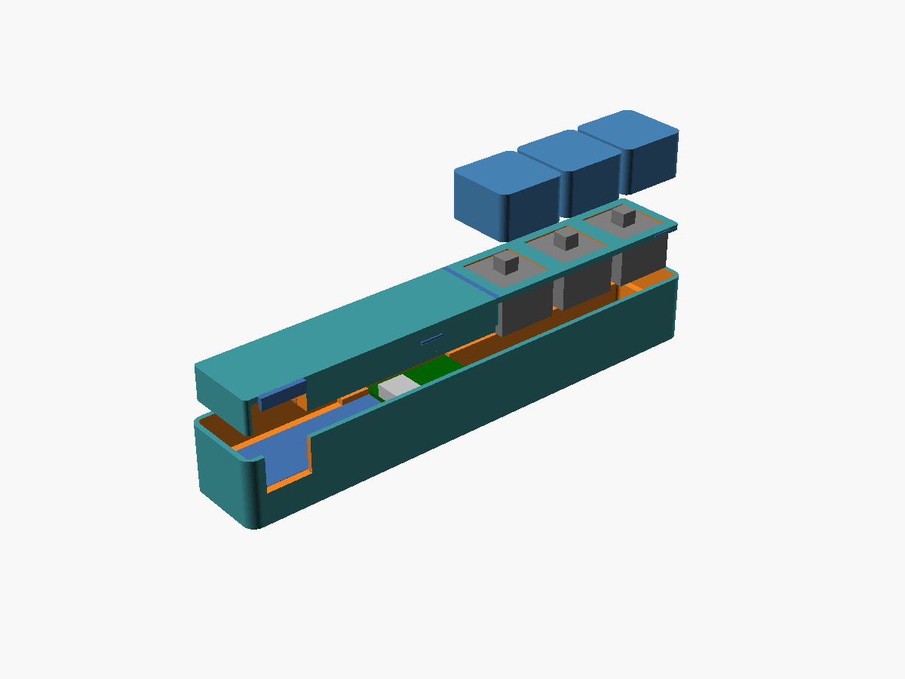

# Magic Macropad

A thin, three-key macropad that plugs straight into your MacBook's side USB-C
port and sits flush along the chassis, plus the menu-bar app that turns each
key into tap, double-tap, triple-tap, and hold actions.

> **Status: early prototype.** The firmware and app work, and the enclosures
> are tuned against real prints. Expect rough edges. The hardware's codename
> is **K1**, and you'll see it in file names and code.

## Features

- **Three keys, twelve bindings.** Each key does something different on tap,
  double-tap, triple-tap, and hold.
- **Per-app profiles.** Bindings follow the frontmost app and fall back to
  your Default profile.
- **Built-in actions:**
  - Open an app, URL, file, or folder
  - Keyboard shortcuts, with a recorder
  - Media: play/pause, previous/next, volume, mute
  - Paste a text snippet
  - System: app switcher (⌘Tab), mic mute, lock screen, display sleep, dark
    mode, region screenshot, Mission Control, keep-awake
  - AI: new Claude or ChatGPT chat, dictation
  - Shell scripts, with a preset library that includes Claude CLI helpers
    like "Improve Writing" for whatever's on the clipboard
- **No drivers.** The device is a vendor-defined USB HID device, so macOS
  needs nothing installed. Gesture timing lives in the app, so you can tune
  it without reflashing.
- **Key-press light.** The board's RGB LED glows red, green, or blue while a
  key is held.

There's also one easter egg. Try pressing all three keys at once.

## How it works

    keys ──► RP2040 firmware ─── USB HID ───► Magic Macropad app
             debounce, down/up events          HIDService → GestureEngine
             8-byte reports + sequence byte      → ActionEngine (per-app profiles)

The firmware only reports debounced key down/up events. It uses a
vendor-defined HID interface (usage page `0xFF60`, 8-byte reports with a
sequence byte). The app does everything else: gesture detection, profiles, and
running actions. The full design is in
[`docs/superpowers/specs/`](docs/superpowers/specs/).

## Build one

You'll need an RP2040-Zero, three MX-style switches and keycaps, some thin
wire, a 3D printer, and a soldering iron. The side-mount version also needs a
90° USB-C adapter and a USB-C coupler; the desk version uses a normal cable.

**[The build guide](docs/build-guide.md)** walks through it step by step:

1. Choose a variant: side-mount or desk
2. Gather parts and tools
3. Print the enclosure
4. Flash the firmware
5. Install the app
6. Wire and test the switches, with a wiring diagram and a self-test
7. Assemble
8. Troubleshooting
9. Changing the enclosure, for other USB parts or printers

Prebuilt firmware is on the
[Releases page](https://github.com/Magic-Technologies-Inc/magic-macropad/releases),
so you only need the firmware toolchain if you change the firmware. No board
yet? You can still install the app (step 5). Its **Test keys** menu simulates
presses.

## Repository layout

- `cad/`: OpenSCAD enclosure, one folder per revision (`v5/` and `desk/v2/`
  are current)
- `firmware/`: Pico SDK and TinyUSB firmware for the RP2040-Zero
- `mac/`: the menu-bar app (SwiftUI). `MagicKeysCore/` holds the unit-tested
  core. The target and package still use the older "Magic Keys" name.
- `docs/build-guide.md`: the step-by-step build guide
- `docs/superpowers/`: design specs and implementation plans. They predate the
  Magic Macropad name, so they still say "K1" and "Magic Keys".

## Contributing

See [CONTRIBUTING.md](CONTRIBUTING.md).

## License

Magic Macropad (hardware designs, firmware, and app) is © 2026 Magic
Technologies Inc., licensed under
[CC BY-NC-SA 4.0](https://creativecommons.org/licenses/by-nc-sa/4.0/). The
full text is in [LICENSE](LICENSE).

In plain English (the license itself is what counts):

- ✅ You can build one, change it, and share your changes. Credit Magic and
  keep the same license.
- ❌ You can't sell devices, kits, printed parts, or the software, modified or
  not.
- **Additional permission:** beyond CC BY-NC-SA 4.0, Magic Technologies Inc.
  lets you use a Magic Macropad you built yourself, along with its firmware
  and app, for your work, including at a for-profit company. This covers use
  only. It doesn't allow selling, renting, or otherwise commercially
  distributing devices, kits, parts, design files, or software.

For commercial licensing, get in touch at [usemagic.io](https://usemagic.io).

Some bundled fonts, a sound, and two small firmware files are third-party and
keep their own licenses; see [THIRD_PARTY_NOTICES.md](THIRD_PARTY_NOTICES.md). The Magic name and logo aren't
licensed at all; see [TRADEMARKS.md](TRADEMARKS.md).

---

Made by [Magic](https://usemagic.io).
